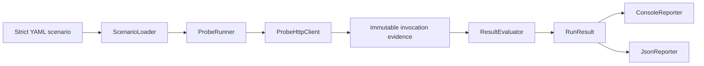
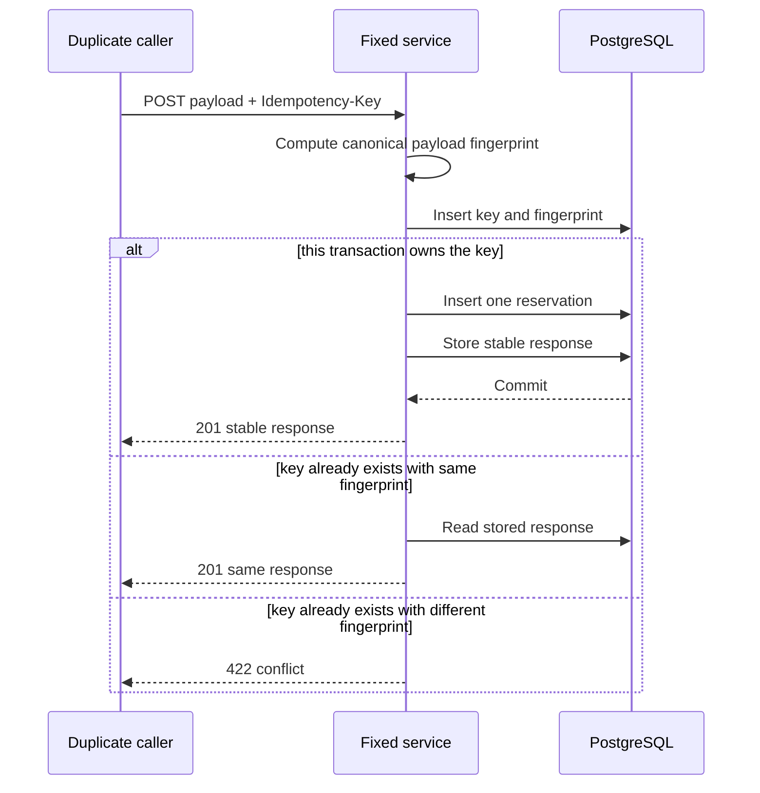

# IdemProbe architecture

IdemProbe separates configuration, execution, captured evidence, semantic
evaluation, and reporting. Each boundary carries only the data needed by the
next stage.

## Configuration boundary

`ScenarioLoader` maps YAML into records and rejects unknown fields, null or
incomplete sections, unsupported methods, invalid HTTP URLs, non-positive
duplicate counts, an empty status set, and a missing `${probe.key}` header
token. The token is deliberately not a general template language: one UUID is
generated per run and substituted into target header values only.

## Execution boundary

`ProbeRunner` performs sequential requests first. For concurrent requests it
uses one Java virtual thread per invocation. Every worker signals a `ready`
latch and waits on one `start` latch; the runner releases the gate only after
all workers are ready. This creates intentional overlap without relying on task
submission timing.

All duplicates use the same generated key. Completed concurrent results are
sorted by invocation index before they leave the runner, then the required GET
verification request runs.

## Evidence boundary

The HTTP adapter returns either `HttpInvocationResult` or `TransportFailure`.
The evidence records carry invocation index, phase, status or failure, response
body, and elapsed duration for in-process evaluation. They do not carry the
request or its headers.

Reporting narrows that evidence further. JSON schema version `1` includes only
index, phase, outcome, HTTP status when available, verification evidence, and
structured findings. It excludes request URLs, headers, bodies, response
bodies, generated keys, timestamps, and timings. Property ordering is stable,
and invocation evidence is sorted by phase and index.

## Evaluation boundary

`ResultEvaluator` checks the evidence shape, allowed statuses, readable and
stable response identities, verification status, and the numeric side-effect
count. Semantic failures become `Finding` records instead of exceptions.
`RunResult` derives the public exit code:

- `0`: no findings;
- `1`: one or more idempotency findings;
- `2`: a finding prevents a valid verdict.

Configuration and runtime exceptions are handled at the command boundary and
also exit `2`.

## Reporting boundary

The console reporter is the default. `--json PATH` selects the JSON reporter
and writes to that exact path instead of standard output. Reporter failures are
runtime failures and exit `2`; reporter selection does not alter a successfully
written `RunResult` exit code.

## Demo transaction

The vulnerable service ignores the key and inserts once per call. The fixed
service relies on a PostgreSQL unique constraint rather than JVM-local locking:

The unique constraint is the cross-process race boundary. The demo validates a
specific transaction model; the probe itself does not prove that an arbitrary
target uses the same implementation or that unobserved side effects do not
exist.
